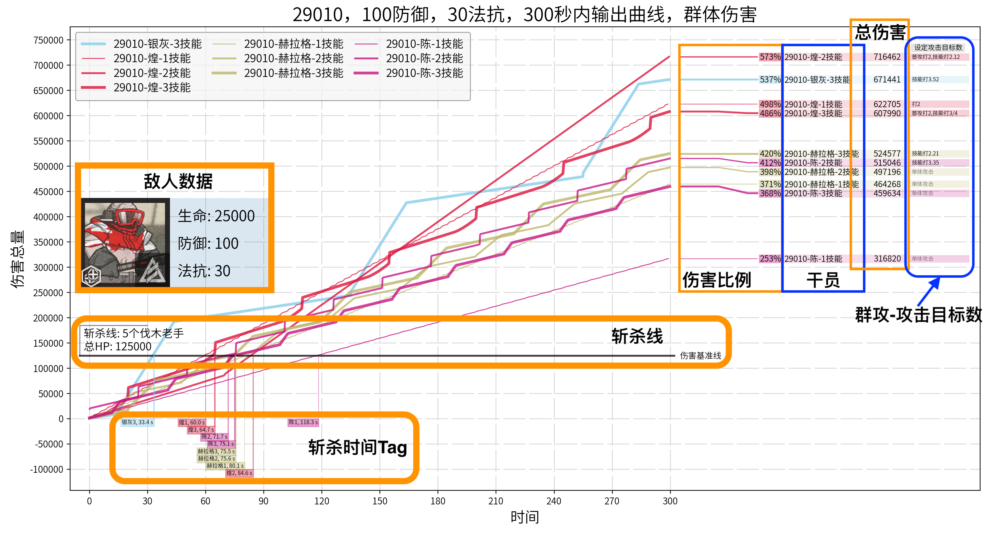
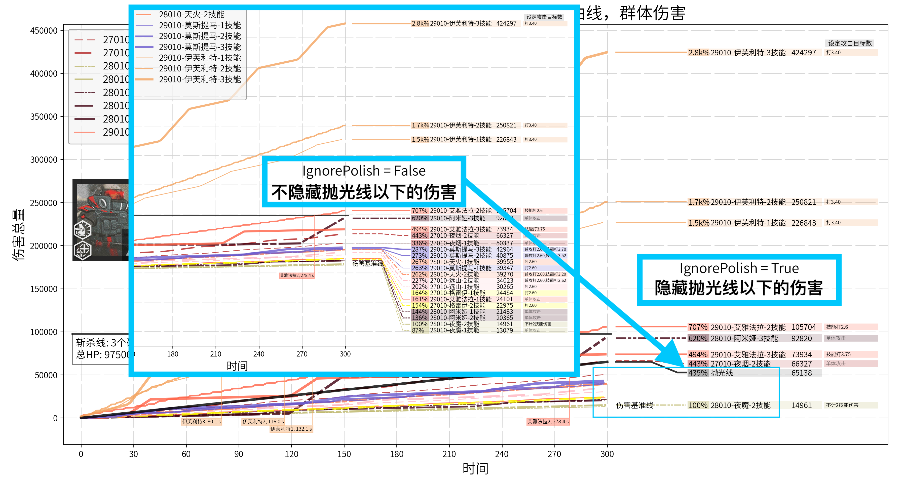

# ArknightsDamageCurve-明日方舟伤害曲线模拟器

 A simple *python* script to generate damage curve for game **Arknights**
 
 一个简单的python代码，用于生成300秒内各个干员的期望伤害的时间曲线
 
  数据和影像资源全部来自于游戏本体，如遇版权问题，可能随时删除（我猜这玩意儿应该遇不上版权问题）

## Guide-导航
* 中文：
	* [环境配置](#环境配置-中文)  
	* [代码用法](#代码用法-中文)
	* [参数设置](#参数设置-中文)

* English：
	* [Requirements](#Requirements-Eng)
	* [Usage](#Usage-Eng)


<span id="环境配置-中文"></span>
## 环境配置

* 需要 [*Python*](https://www.python.org/)。理论上这份代码需要 *Python >= 3.6*，但我只在 *Python 3.7* 上测试过。
* 需要 [*matplotlib*](https://matplotlib.org/) >= 3.0 <br> Windows, Mac 和 Linux 均可通过 [pip](https://pypi.org/project/pip/) 安装*matplotlib*

	```
	python -m pip install -U pip 
	python -m pip install -U matplotlib
	```
* 需要 [思源黑体](https://github.com/adobe-fonts/source-han-sans) *字体*  <br> *matplotlib* 需要 TrueTypeFont (TTF) 文件, 但源文件没有TTF版本。所以我附带了一份我自己转换的 `SourceHanSansSC-Normal.ttf`
* 需要配置 *matplotlib* 来让它支持中文字体 <br> 你可以在知乎问题 [https://www.zhihu.com/question/25404709](https://www.zhihu.com/question/25404709) 里找到 Windows 和 Mac 中的 *matplotlib* 的中文配置方法
* 在环境配置结束后，Clone or Download 这个文件夹至你的电脑，然后即可使用命令行或你的IDE运行python代码

<span id="代码用法-中文"></span>
## 代码用法

1. <font color=brown>**简单用法：**</font>通过运行 `main.py` 来生成默认的一系列伤害曲线图
	* `python main.py`，当然你也可以在IDE里运行
	* 运行后会生成一系列的图片，包括了5种在高难合约里常见的干员组合面对各种敌人时的输出期望曲线
	* 预设的角色组合如下:
<table>
  <tr> <th align=center>组合</th> <th colspan="3" align=center>角色</th> </tr>
  <tr> <td rowspan="2" align=center>Melee Physical<br>近战物理干员</td> <td>煌</td> <td>赫拉格</td> <td>陈</td> </tr>
  <tr> <td>银灰 (3)</td> <td></td> <td></td> </tr>
  <tr> <td rowspan="2" align=center>Melee Magic<br>近战法术干员</td> <td>陈 (2)</td> <td>布洛卡 (2)</td> <td>星极</td> </tr>
  <tr> <td>拉普兰德 (2)</td> <td>慕斯</td> <td></td> </tr>
  <tr> <td rowspan="2" align=center>Ranged Physical<br>高台物理干员</td> <td>黑 (2,3)</td> <td>能天使 (2,3)</td> <td>送葬人</td> </tr>
  <tr> <td>陨星</td> <td>蓝毒</td> <td></td> </tr>
  <tr> <td rowspan="1" align=center>Ranged Magic<br>高台法术干员</td> <td>安洁莉娜</td> <td>艾雅法拉</td> <td>伊芙利特</td> </tr>	<tr> <td rowspan="2" align=center>Control<br>控制队干员</td> <td>安洁莉娜 (2,3)</td> <td>莫斯提马 (2)</td> <td>格劳克斯 (2)</td> </tr>
  <tr> <td>食铁兽</td> <td>狮蝎 (1)</td> <td>伊桑 (2)</td></tr>
</table>

2. <font color=brown>**进阶用法：**</font>通过运行 `plot.py ` 来生成你自己想要的伤害曲线图，但你需要进行一些参数的设置
	* 修改 `plot.py` 中的参数，主要在 `__main__` 函数部分。你可以参考 `plot.py` 中的一些预设的参数
	* 在 `plot.plot(...)` 你可以看到更多的关于参数的注释
	  
3. 过一段时间会增加更多的介绍，包括假想敌的设置、更具体的用法、参数介绍、例子说明等 <del>在做了咕咕咕咕咕咕</del>

<span id="参数设置-中文"></span>
## 参数设置

### 常用参数

* `plot.py / Stage`
> 目前支持 "29010", "25010", "2307" 三个参数  
> 会自动读取对应练度的干员数据，并以此计算伤害曲线  
> "29010" 时，高于等级上限的数据会自动修正为满级数据  

* `plot.py / Pick`　
>> 设置后，会读取 `DefaultPickList` 内的对应数据  
>
> (1) `plot.py / PickList`
>> 作图时，只会显示 `PickList` 内的干员的输出曲线
>
> (2) `plot.py / PickListName`
>
>> 文件名会标注 `PickListName`
>
> (3) `plot.py / Baseline`
>
>> 作图时，会以 `Baseline` 对应的干员的总伤害为100%  
>> 其他干员的数据会进一步换算为该数据的百分比，以便读数

* `plot.py / Enemy`
> 支持 `character.py / enemy_dict` 内的内容  
> 会读取对应敌人的数据，并按照该敌人的 生命，防御，法抗 来计算干员的输出  
> 会自动安装敌人生命计算敌人数目，使得多个敌人的总生命大约在到 80,000 ~ 150,000 之间  
> 敌人数据会显示出来，若想自己增添新的敌人，可以参考 `character.py / enemy_dict` 的格式，并在 [图片](#example1) 中展示出来

* `plot.py / ShowSlayLine`
> 若为 `True`，则会显示斩杀线和斩杀时间  
> 在下方的 [斩杀线示例图片](#example1) 中可以看到 “斩杀线和斩杀时间” 是什么

* `plot.py / MultiTarget`
> 若为 `True`，则会按照 `character.py / target_num_dict` 中填写的攻击目标数来计算总伤害  
> 在 总伤害图例右侧，即图片的最右端，会同时显示攻击的目标数量
> 在附录里有 所有攻击范围的攻击目标数 的表格，仅供参考  
> *想要自定义攻击目标数的同志们可以好好考虑一下，填写攻击目标数是一个困难的任务，我的数据也有许多不合理之处，如果有老哥能提供更合理的假设那就再好不过了*

* `plot.py / IgnorePolish`
> 若为 `True`，则会按照一个公式计算抛光线，输出低于抛光线的干员的图例将不显示  
> 抛光线计算公式在 `plot.py / plot_legend` 中的 `polish_line = ...` 部分  
> 默认公式为：$\text{polish_line} = \sqrt{\frac{\text{max_damage}}{10,000}} \times 10,000$  
> 在下方的 [抛光线示例图片](#example2) 中可以看到 “斩杀线和斩杀时间” 是什么  
> *这是为了防止在面对特殊敌人时抛光干员太多，导致图例集中在图片下部过于集中，影响阅读*

### 进阶参数

* `plot.py / DefaultPickList`
> 这是一个词典 (Dict)，你可以任意选择或增删内部的词条，从而能够生成不同的干员组合的输出曲线

* `character.py / Charge_on_defense_equivalent_charge_speed` <br> `character.py / Hellagur_talent_hp_ratio` <br> `character.py / Provence_Wolfeye_target_hp_ratio`
> 三个参数分别对应：
>> 受击回复干员等效的每秒回复sp量  
>> 赫拉格的生命比例（以此计算攻击速度）  
>> 普罗旺斯-狼眼的敌人生命比例（以此计算伤害）

* `character.py / color_dict`
> 可以自定义干员的输出曲线的颜色，如果你看不清曲线，可以调整曲线颜色  
> *默认的曲线颜色参考了干员精二立绘里，干员的替身的颜色*  

### 示例图片

图片部分元素展示：


抛光线效果展示：



<span id="Requirements-Eng"></span>
## Requirements

* Requires *Python*. In theory this code can be run on *Python >= 3.6*, but I only test this code in *Python 3.7*
* Requires [*matplotlib*](https://matplotlib.org/) >= 3.0. <br> Both Windows, Mac and Linux can install *matplotlib* from [pip](https://pypi.org/project/pip/)

	```
	python -m pip install -U pip 
	python -m pip install -U matplotlib
	```
* Requires *Font* [思源黑体](https://github.com/adobe-fonts/source-han-sans). <br> *matplotlib* requires TrueTypeFont file, but the source file is not provided in TTF version. So I provide a converted version `SourceHanSansSC-Normal.ttf` in the repo.
* You also need to configure your *matplotlib* to make it support Chinese font. <br> You may check [https://www.zhihu.com/question/25404709](https://www.zhihu.com/question/25404709), where both Mac and Windows can find instructions for setting Chinese font.

<span id="Usage-Eng"></span>
## Usage

1. <font color=brown>**Simple usage:**</font> To generate default damage curve images, run:
	* `python main.py`, or run the code in your IDE
	* It will automatically generate a series of images, containing the damage curves for some most commonly used characters.
	* Default characters are listed below:
<table>
  <tr> <th align=center>Group</th> <th colspan="3" align=center>Characters</th> </tr>
  <tr> <td rowspan="2" align=center>Melee Physical</td> <td>Blaze</td> <td>Hellagur</td> <td>Ch'en</td> </tr>
  <tr> <td>Silver Ash (3)</td> <td></td> <td></td> </tr>
  <tr> <td rowspan="2" align=center>Melee Magic</td> <td>Ch'en (2)</td> <td>Broca (2)</td> <td>Astesia</td> </tr>
  <tr> <td>Lappland (2)</td> <td>Mousse</td> <td></td> </tr>
  <tr> <td rowspan="2" align=center>Ranged Physical</td> <td>Schwarz (2,3)</td> <td>Exusiai (2,3)</td> <td>Executor</td> </tr>
  <tr> <td>Meteorite</td> <td>Blue Poisson</td> <td></td> </tr>
  <tr> <td rowspan="1" align=center>Ranged Magic</td> <td>Angelina</td> <td>Eyjafjalla</td> <td>Ifrit</td> </tr>
  <tr> <td rowspan="2" align=center>Control</td> <td>Angelina (2,3)</td> <td>Mostima (2)</td> <td>Glaucus (2)</td> </tr>
  <tr> <td>FEater</td> <td>Manticore (1)</td> <td>Ethan (2)</td></tr>
</table>

2. <font color=brown>**More usages:**</font> To generate customized damage curve, you need to:
	* Change parameters in `plot.py`. There are some preset parameters in `plot.py`
	* You can see more description of those parameters in the comment of `plot.plot(...)`
	  
3. More descriptions will be added in the future
  