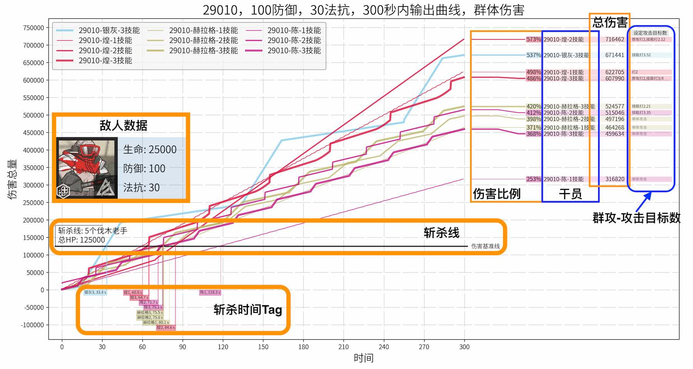
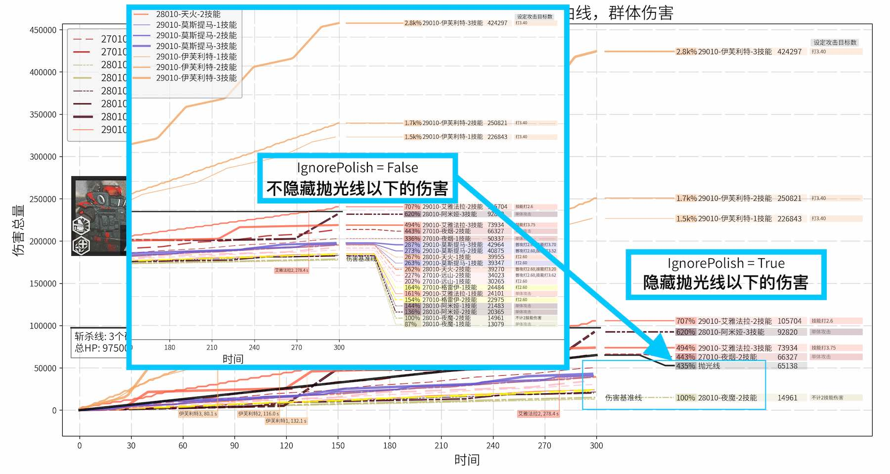

# ArknightsDamageCurve-明日方舟伤害曲线模拟器

 A simple *python* script to generate damage curve for game **Arknights**
 
 一个简单的python代码，用于生成300秒内各个干员的期望伤害的时间曲线
 
  数据和影像资源全部来自于游戏本体，如遇版权问题，可能随时删除（我猜这玩意儿应该遇不上版权问题）

## Guide-导航
* 中文：
	* [环境配置](#环境配置-中文)  
	* [代码用法](#代码用法-中文)
	* [参数设置](#参数设置-中文)

* English：
	* [Requirements](#Requirements-Eng)
	* [Usage](#Usage-Eng)


<span id="环境配置-中文"></span>
## 环境配置

* 需要 [*Python*](https://www.python.org/)。理论上这份代码需要 *Python >= 3.6*，但我只在 *Python 3.7* 上测试过。
* 需要 [*matplotlib*](https://matplotlib.org/) >= 3.0 <br> Windows, Mac 和 Linux 均可通过 [pip](https://pypi.org/project/pip/) 安装*matplotlib*

	```
	python -m pip install -U pip 
	python -m pip install -U matplotlib
	```
* 需要 [思源黑体](https://github.com/adobe-fonts/source-han-sans) *字体*  <br> *matplotlib* 需要 TrueTypeFont (TTF) 文件, 但源文件没有TTF版本。所以我附带了一份我自己转换的 `SourceHanSansSC-Normal.ttf` <br> 由于中文字体文件比较大 (19.2MB)，所以也传到了百度网盘上，不必通过Git下载：[思源黑体TTF](https://pan.baidu.com/s/1KKjovduK4FfdjBbA8MnxfA) 提取码: fgy3  
* 需要配置 *matplotlib* 来让它支持中文字体 <br> 你可以在知乎问题 [https://www.zhihu.com/question/25404709](https://www.zhihu.com/question/25404709) 里找到 Windows 和 Mac 中的 *matplotlib* 的中文配置方法
* 在环境配置结束后，Clone or Download 这个文件夹至你的电脑，然后即可使用命令行或你的IDE运行python代码

<span id="代码用法-中文"></span>
## 代码用法

1. <font color=brown>**简单用法：**</font>通过运行 `main.py` 来生成默认的一系列伤害曲线图
	* `python main.py`，当然你也可以在IDE里运行
	* 运行后会生成一系列的图片，包括了5种在高难合约里常见的干员组合面对各种敌人时的输出期望曲线
	* 预设的角色组合如下:
<table>
  <tr> <th align=center>组合</th> <th colspan="3" align=center>角色</th> </tr>
  <tr> <td rowspan="2" align=center>Melee Physical<br>近战物理干员</td> <td>煌</td> <td>赫拉格</td> <td>陈</td> </tr>
  <tr> <td>银灰 (3)</td> <td></td> <td></td> </tr>
  <tr> <td rowspan="2" align=center>Melee Magic<br>近战法术干员</td> <td>陈 (2)</td> <td>布洛卡 (2)</td> <td>星极</td> </tr>
  <tr> <td>拉普兰德 (2)</td> <td>慕斯</td> <td></td> </tr>
  <tr> <td rowspan="2" align=center>Ranged Physical<br>高台物理干员</td> <td>黑 (2,3)</td> <td>能天使 (2,3)</td> <td>送葬人</td> </tr>
  <tr> <td>陨星</td> <td>蓝毒</td> <td></td> </tr>
  <tr> <td rowspan="1" align=center>Ranged Magic<br>高台法术干员</td> <td>安洁莉娜</td> <td>艾雅法拉</td> <td>伊芙利特</td> </tr>	<tr> <td rowspan="2" align=center>Control<br>控制队干员</td> <td>安洁莉娜 (2,3)</td> <td>莫斯提马 (2)</td> <td>格劳克斯 (2)</td> </tr>
  <tr> <td>食铁兽</td> <td>狮蝎 (1)</td> <td>伊桑 (2)</td></tr>
</table>

2. <font color=brown>**进阶用法：**</font>通过运行 `plot.py ` 来生成你自己想要的伤害曲线图，但你需要进行一些[参数的设置](#参数设置-中文)
	* 修改 `plot.py` 中的参数，主要在 `__main__` 函数部分。你可以参考 `plot.py` 中的一些预设的参数
	* 在 `plot.plot(...)` 你可以看到更多的关于参数的注释
	  
3. 过一段时间会增加更多的介绍，包括假想敌的设置、更具体的用法、参数介绍、例子说明等 <del>在做了咕咕咕咕咕咕</del>

<span id="参数设置-中文"></span>
## 参数设置

### 常用参数

* `plot.py / Stage`
> 目前支持 "29010", "25010", "2307" 三个参数  
> 会自动读取对应练度的干员数据，并以此计算伤害曲线  
> "29010" 时，高于等级上限的数据会自动修正为满级数据  

* `plot.py / Pick`　
>> 设置后，会读取 `DefaultPickList` 内的对应数据  
>
> (1) `plot.py / PickList`
>> 作图时，只会显示 `PickList` 内的干员的输出曲线
>
> (2) `plot.py / PickListName`
>
>> 文件名会标注 `PickListName`
>
> (3) `plot.py / Baseline`
>
>> 作图时，会以 `Baseline` 对应的干员的总伤害为100%  
>> 其他干员的数据会进一步换算为该数据的百分比，以便读数

* `plot.py / Enemy`
> 支持 `character.py / enemy_dict` 内的内容  
> 会读取对应敌人的数据，并按照该敌人的 生命，防御，法抗 来计算干员的输出  
> 会自动安装敌人生命计算敌人数目，使得多个敌人的总生命大约在到 80,000 ~ 150,000 之间  
> 敌人数据会显示出来，若想自己增添新的敌人，可以参考 `character.py / enemy_dict` 的格式，并在 [图片](#example1) 中展示出来

* `plot.py / ShowSlayLine`
> 若为 `True`，则会显示斩杀线和斩杀时间  
> 在下方的 [斩杀线示例图片](#example1) 中可以看到 “斩杀线和斩杀时间” 是什么

* `plot.py / MultiTarget`
> 若为 `True`，则会按照 `character.py / target_num_dict` 中填写的攻击目标数来计算总伤害  
> 在 总伤害图例右侧，即图片的最右端，会同时显示攻击的目标数量
> 在 [附录](#攻击目标数-中文) 里有 *所有攻击范围对应的攻击目标数* 的表格，仅供参考  
> *想要自定义攻击目标数的同志们可以好好考虑一下，填写攻击目标数是一个困难的任务，我的数据也有许多不合理之处，如果有老哥能提供更合理的假设那就再好不过了*

* `plot.py / IgnorePolish`
> 若为 `True`，则会按照一个公式计算抛光线，输出低于抛光线的干员的图例将不显示  
> 抛光线计算公式在 `plot.py / plot_legend` 中的 `polish_line = ...` 部分  
> 默认公式为：$\text{polish_line} = \sqrt{\frac{\text{max_damage}}{10,000}} \times 10,000$  
> 在下方的 [抛光线示例图片](#example2) 中可以看到 “斩杀线和斩杀时间” 是什么  
> *这是为了防止在面对特殊敌人时抛光干员太多，导致图例集中在图片下部过于集中，影响阅读*

### 进阶参数

* `plot.py / DefaultPickList`
> 这是一个词典 (Dict)，你可以任意选择或增删内部的词条，从而能够生成不同的干员组合的输出曲线

* `character.py / Charge_on_defense_equivalent_charge_speed` <br> `character.py / Hellagur_talent_hp_ratio` <br> `character.py / Provence_Wolfeye_target_hp_ratio`
> 三个参数分别对应：
>> 受击回复干员等效的每秒回复sp量  
>> 赫拉格的生命比例（以此计算攻击速度）  
>> 普罗旺斯-狼眼的敌人生命比例（以此计算伤害）

* `character.py / color_dict`
> 可以自定义干员的输出曲线的颜色，如果你看不清曲线，可以调整曲线颜色  
> *默认的曲线颜色参考了干员精二立绘里，干员的替身的颜色*  

### 示例图片
注：这俩图片可能需要一段时间才能加载出来

图片部分元素展示：


抛光线效果展示：



<span id="Requirements-Eng"></span>
## Requirements

* Requires *Python*. In theory this code can be run on *Python >= 3.6*, but I only test this code in *Python 3.7*
* Requires [*matplotlib*](https://matplotlib.org/) >= 3.0. <br> Both Windows, Mac and Linux can install *matplotlib* from [pip](https://pypi.org/project/pip/)

	```
	python -m pip install -U pip 
	python -m pip install -U matplotlib
	```
* Requires *Font* [思源黑体](https://github.com/adobe-fonts/source-han-sans). <br> *matplotlib* requires TrueTypeFont file, but the source file is not provided in TTF version. So I provide a converted version `SourceHanSansSC-Normal.ttf` in the repo.
* You also need to configure your *matplotlib* to make it support Chinese font. <br> You may check [https://www.zhihu.com/question/25404709](https://www.zhihu.com/question/25404709), where both Mac and Windows can find instructions for setting Chinese font.

<span id="Usage-Eng"></span>
## Usage

1. <font color=brown>**Simple usage:**</font> To generate default damage curve images, run:
	* `python main.py`, or run the code in your IDE
	* It will automatically generate a series of images, containing the damage curves for some most commonly used characters.
	* Default characters are listed below:
<table>
  <tr> <th align=center>Group</th> <th colspan="3" align=center>Characters</th> </tr>
  <tr> <td rowspan="2" align=center>Melee Physical</td> <td>Blaze</td> <td>Hellagur</td> <td>Ch'en</td> </tr>
  <tr> <td>Silver Ash (3)</td> <td></td> <td></td> </tr>
  <tr> <td rowspan="2" align=center>Melee Magic</td> <td>Ch'en (2)</td> <td>Broca (2)</td> <td>Astesia</td> </tr>
  <tr> <td>Lappland (2)</td> <td>Mousse</td> <td></td> </tr>
  <tr> <td rowspan="2" align=center>Ranged Physical</td> <td>Schwarz (2,3)</td> <td>Exusiai (2,3)</td> <td>Executor</td> </tr>
  <tr> <td>Meteorite</td> <td>Blue Poisson</td> <td></td> </tr>
  <tr> <td rowspan="1" align=center>Ranged Magic</td> <td>Angelina</td> <td>Eyjafjalla</td> <td>Ifrit</td> </tr>
  <tr> <td rowspan="2" align=center>Control</td> <td>Angelina (2,3)</td> <td>Mostima (2)</td> <td>Glaucus (2)</td> </tr>
  <tr> <td>FEater</td> <td>Manticore (1)</td> <td>Ethan (2)</td></tr>
</table>

2. <font color=brown>**More usages:**</font> To generate customized damage curve, you need to:
	* Change parameters in `plot.py`. There are some preset parameters in `plot.py`
	* You can see more description of those parameters in the comment of `plot.plot(...)`
	  
3. More descriptions will be added in the future
  
 
## 附录

<span id="攻击目标数-中文"></span>
#### 攻击目标数表格
<table>
  <tr> <th width="10%">文本描述</th><th width="10%">范围代号</th><th width="10%">干员</th><th width="25%">攻击范围<br>对应干员</th><th width="5%">打2</th><th width="5%">打3</th><th width="5%">打4</th><th width="5%">打5</th><th width="5%">打6</th><th width="5%">打7</th><th width="5%">群攻</th> </tr>
  <tr> 
    <td>0格</td>
    <td>0-1</td>
    <td colspan="2">火神 (2)<br>格拉尼 (2)<br>坚雷 (2)<br>麦哲伦 (2) - 技能</td>
    <td bgcolor="#E0FFE0">1.3</td>
    <td bgcolor="#E0FFE0">1.87</td>
    <td><font color=gray size=2>2.2</font></td>
    <td><font color=gray size=2>2.31</font></td>
    <td><font color=gray size=2>2.35</font></td>
    <td><font color=gray size=2>2.38</font></td>
    <td bgcolor="#E0FFE0">2.4</td> </tr>
  <tr> 
    <td>1格</td>
    <td>1-1</td>
    <td colspan="2">群卫<br>星极 (2)<br>星熊 (2)<br>煌 (3) - 切割</td>
    <td bgcolor="#E0FFE0">1.4</td>
    <td bgcolor="#E0FFE0">2</td>
    <td><font color=gray size=2>2.4</font></td>
    <td><font color=gray size=2>2.57</font></td>
    <td><font color=gray size=2>2.63</font></td>
    <td><font color=gray size=2>2.67</font></td>
    <td bgcolor="#E0FFE0">2.7</td> </tr>
  <tr> 
    <td>2格</td>
    <td>2-2</td>
    <td colspan="2">煌 (2)<br>雷蛇 (2)<br>赫拉格 (3, 1~7级)</td>
    <td bgcolor="#E0FFE0">1.5</td>
    <td bgcolor="#E0FFE0">2.12</td>
    <td bgcolor="#E0FFE0">2.52</td>
    <td><font color=gray size=2>2.7</font></td>
    <td><font color=gray size=2>2.85</font></td>
    <td><font color=gray size=2>2.9</font></td>
    <td><font color=gray size=2>2.95</font></td> </tr>
  <tr> 
    <td>3格</td>
    <td>3-2</td>
    <td colspan="2">暴行 (2)<br>布洛卡 (2)<br>赫拉格 (3, 8~10级)</td>
    <td bgcolor="#E0FFE0">1.55</td>
    <td bgcolor="#E0FFE0">2.21</td>
    <td bgcolor="#E0FFE0">2.61</td>
    <td bgcolor="#E0FFE0">2.82</td>
    <td><font color=gray size=2>3.02</font></td>
    <td><font color=gray size=2>3.08</font></td>
    <td><font color=gray size=2>3.15</font></td> </tr>
  <tr> 
    <td>4格</td>
    <td>4-1</td>
    <td colspan="2">暗索 (2)</td>
    <td bgcolor="#E0FFE0">1.6</td>
    <td><font color=gray size=2>2.28</font></td>
    <td><font color=gray size=2>2.71</font></td>
    <td><font color=gray size=2>2.93</font></td>
    <td><font color=gray size=2>3.14</font></td>
    <td><font color=gray size=2>3.21</font></td>
    <td><font color=gray size=2>3.3</font></td> </tr>
  <tr> 
    <td>5格</td>
    <td>5-1</td>
    <td colspan="2">伊芙利特</td>
    <td><font color=gray size=2>1.65</font></td>
    <td><font color=gray size=2>2.35</font></td>
    <td><font color=gray size=2>2.8</font></td>
    <td><font color=gray size=2>3.03</font></td>
    <td><font color=gray size=2>3.2</font></td>
    <td><font color=gray size=2>3.3</font></td>
    <td bgcolor="#E0FFE0">3.4</td> </tr>
  <tr> 
    <td><font color=gray size=2>2格远卫</font></td>
    <td><font color=gray size=2>2-3</font></td>
    <td colspan="2"><font color=gray size=2>精零 远卫<br>精零 群法<br>精零 近狙</font></td>
    <td><font color=gray size=2>1.6</font></td>
    <td><font color=gray size=2>2.3</font></td>
    <td><font color=gray size=2>2.75</font></td>
    <td><font color=gray size=2>2.97</font></td>
    <td><font color=gray size=2>3.19</font></td>
    <td><font color=gray size=2>3.28</font></td>
    <td><font color=gray size=2>3.35</font></td> </tr>
  <tr> 
    <td>3格远卫</td>
    <td>3-12</td>
    <td colspan="2">拉普兰德 (2)<br>陈 (2)</td>
    <td bgcolor="#E0FFE0">1.65</td>
    <td><font color=gray size=2>2.35</font></td>
    <td bgcolor="#E0FFE0">2.83</td>
    <td bgcolor="#E0FFE0">3.07</td>
    <td bgcolor="#E0FFE0">3.25</td>
    <td bgcolor="#E0FFE0">3.35</td>
    <td><font color=gray size=2>3.45</font></td> </tr>
  <tr> 
    <td><font color=gray size=2>1格扇形</font></td>
    <td><font color=gray size=2>1-2</font></td>
    <td colspan="2"><font color=gray size=2>银灰 (2)</font></td>
    <td><font color=gray size=2>1.5</font></td>
    <td><font color=gray size=2>2.12</font></td>
    <td><font color=gray size=2>2.54</font></td>
    <td><font color=gray size=2>2.74</font></td>
    <td><font color=gray size=2>2.87</font></td>
    <td><font color=gray size=2>2.94</font></td>
    <td><font color=gray size=2>3</font></td> </tr>
  <tr> 
    <td><font color=gray size=2>2格扇形</font></td>
    <td><font color=gray size=2>2-1</font></td>
    <td colspan="2"><font color=gray size=2>暂无</font></td>
    <td><font color=gray size=2>1.65</font></td>
    <td><font color=gray size=2>2.37</font></td>
    <td><font color=gray size=2>2.83</font></td>
    <td><font color=gray size=2>3.07</font></td>
    <td><font color=gray size=2>3.24</font></td>
    <td><font color=gray size=2>3.35</font></td>
    <td><font color=gray size=2>3.45</font></td> </tr>
  <tr> 
    <td><font color=gray size=2>2+1格扇形</font></td>
    <td><font color=gray size=2>3-11</font></td>
    <td colspan="2"><font color=gray size=2>暂无</font></td>
    <td><font color=gray size=2>1.67</font></td>
    <td><font color=gray size=2>2.4</font></td>
    <td><font color=gray size=2>2.86</font></td>
    <td><font color=gray size=2>3.1</font></td>
    <td><font color=gray size=2>3.27</font></td>
    <td><font color=gray size=2>3.38</font></td>
    <td><font color=gray size=2>3.48</font></td> </tr>
  <tr> 
    <td>3格扇形</td>
    <td>3-7</td>
    <td colspan="2">银灰 (3)</td>
    <td><font color=gray size=2>1.75</font></td>
    <td bgcolor="#E0FFE0">2.5</td>
    <td bgcolor="#E0FFE0">2.95</td>
    <td bgcolor="#E0FFE0">3.25</td>
    <td bgcolor="#E0FFE0">3.52</td>
    <td><font color=gray size=2>3.7</font></td>
    <td><font color=gray size=2>3.85</font></td> </tr>
  <tr> 
    <td>1格菱形</td>
    <td>x-5</td>
    <td colspan="2">推进之王 (2)</td>
    <td><font color=gray size=2>1.55</font></td>
    <td><font color=gray size=2>2.15</font></td>
    <td><font color=gray size=2>2.58</font></td>
    <td><font color=gray size=2>2.78</font></td>
    <td><font color=gray size=2>2.95</font></td>
    <td><font color=gray size=2>3.03</font></td>
    <td bgcolor="#E0FFE0">3.1</td> </tr>
  <tr> 
    <td>2格菱形</td>
    <td>x-1</td>
    <td colspan="2">德克萨斯 (2)</td>
    <td><font color=gray size=2>1.7</font></td>
    <td><font color=gray size=2>2.42</font></td>
    <td><font color=gray size=2>2.9</font></td>
    <td><font color=gray size=2>3.15</font></td>
    <td><font color=gray size=2>3.35</font></td>
    <td><font color=gray size=2>3.46</font></td>
    <td bgcolor="#E0FFE0">3.55</td> </tr>
  <tr> 
    <td>药物配置</td>
    <td>x-2</td>
    <td colspan="2">真理 (2)</td>
    <td bgcolor="#E0FFE0">1.78</td>
    <td bgcolor="#E0FFE0">2.53</td>
    <td><font color=gray size=2>3.04</font></td>
    <td><font color=gray size=2>3.38</font></td>
    <td><font color=gray size=2>3.65</font></td>
    <td><font color=gray size=2>3.81</font></td>
    <td><font color=gray size=2>3.95</font></td> </tr>
  <tr> 
    <td>3格菱形</td>
    <td>x-3</td>
    <td colspan="2">艾雅法拉 (3)<br>格劳克斯 (2)</td>
    <td><font color=gray size=2>1.8</font></td>
    <td bgcolor="#E0FFE0">2.55</td>
    <td bgcolor="#E0FFE0">3.05</td>
    <td bgcolor="#E0FFE0">3.4</td>
    <td bgcolor="#E0FFE0">3.75</td>
    <td><font color=gray size=2>3.98</font></td>
    <td bgcolor="#E0FFE0">4.15</td> </tr>
  <tr> 
    <td><font color=gray size=2>1格方形</font></td>
    <td><font color=gray size=2>x-4</font></td>
    <td colspan="2"><font color=gray size=2>精零 空</font></td>
    <td><font color=gray size=2>1.62</font></td>
    <td><font color=gray size=2>2.32</font></td>
    <td><font color=gray size=2>2.76</font></td>
    <td><font color=gray size=2>3</font></td>
    <td><font color=gray size=2>3.2</font></td>
    <td><font color=gray size=2>3.28</font></td>
    <td><font color=gray size=2>3.35</font></td> </tr>
  <tr> 
    <td>精一群法</td>
    <td>3-6</td>
    <td colspan="2">莫斯提马 (2)<br>煌 (3) - 爆裂</td>
    <td><font color=gray size=2>1.65</font></td>
    <td><font color=gray size=2>2.38</font></td>
    <td><font color=gray size=2>2.87</font></td>
    <td><font color=gray size=2>3.13</font></td>
    <td><font color=gray size=2>3.3</font></td>
    <td><font color=gray size=2>3.42</font></td>
    <td bgcolor="#E0FFE0">3.52</td> </tr>
  <tr> 
    <td>精零快狙</td>
    <td>3-1</td>
    <td colspan="2">蓝毒 (1)</td>
    <td bgcolor="#E0FFE0">1.68</td>
    <td><font color=gray size=2>2.42</font></td>
    <td><font color=gray size=2>2.92</font></td>
    <td><font color=gray size=2>3.17</font></td>
    <td><font color=gray size=2>3.34</font></td>
    <td><font color=gray size=2>3.46</font></td>
    <td><font color=gray size=2>3.56</font></td> </tr>
  <tr> 
    <td>精一快狙</td>
    <td>3-3</td>
    <td colspan="2">蓝毒 (1, 2)<br>红云 (2)<br>流星 (2)<br>远山 (2)</td>
    <td bgcolor="#E0FFE0">1.7</td>
    <td bgcolor="#E0FFE0">2.44</td>
    <td><font color=gray size=2>2.92</font></td>
    <td bgcolor="#E0FFE0">3.2</td>
    <td><font color=gray size=2>3.4</font></td>
    <td><font color=gray size=2>3.52</font></td>
    <td bgcolor="#E0FFE0">3.62</td> </tr>
  <tr> 
    <td><font color=gray size=2>精一群狙</font></td>
    <td><font color=gray size=2>3-8</font></td>
    <td colspan="2"><font color=gray size=2>精一 群狙</font></font></td>
    <td><font color=gray size=2>1.72</font></td>
    <td><font color=gray size=2>2.46</font></td>
    <td><font color=gray size=2>2.94</font></td>
    <td><font color=gray size=2>3.22</font></td>
    <td><font color=gray size=2>3.43</font></td>
    <td><font color=gray size=2>3.55</font></td>
    <td><font color=gray size=2>3.65</font></td> </tr>
  <tr> 
    <td><font color=gray size=2>精二群狙</font></td>
    <td><font color=gray size=2>3-10</font></td>
    <td colspan="2"><font color=gray size=2>精二 群狙</font></font></td>
    <td><font color=gray size=2>1.74</font></td>
    <td><font color=gray size=2>2.48</font></td>
    <td><font color=gray size=2>2.96</font></td>
    <td><font color=gray size=2>3.25</font></td>
    <td><font color=gray size=2>3.46</font></td>
    <td><font color=gray size=2>3.58</font></td>
    <td><font color=gray size=2>3.7</font></td> </tr>
  <tr> 
    <td><font color=gray size=2>精零敌飚</font></td>
    <td><font color=gray size=2>5-2</font></td>
    <td colspan="2"><font color=gray size=2>暂无</font></font></td>
    <td><font color=gray size=2>1.76</font></td>
    <td><font color=gray size=2>2.5</font></td>
    <td><font color=gray size=2>2.98</font></td>
    <td><font color=gray size=2>3.28</font></td>
    <td><font color=gray size=2>3.5</font></td>
    <td><font color=gray size=2>3.63</font></td>
    <td><font color=gray size=2>3.75</font></td> </tr>
  <tr> 
    <td>精零群奶</td>
    <td>y-1</td>
    <td colspan="2">狮蝎<br>伊桑</td>
    <td><font color=gray size=2>1.65</font></td>
    <td><font color=gray size=2>2.37</font></td>
    <td><font color=gray size=2>2.83</font></td>
    <td><font color=gray size=2>3.07</font></td>
    <td><font color=gray size=2>3.24</font></td>
    <td><font color=gray size=2>3.35</font></td>
    <td bgcolor="#E0FFE0">3.45</td> </tr>
  <tr> 
    <td>精一群奶</td>
    <td>y-2</td>
    <td colspan="2">精零 初雪 (1)<br>格劳克斯 (1)</td>
    <td bgcolor="#E0FFE0">1.68</td>
    <td><font color=gray size=2>2.42</font></td>
    <td><font color=gray size=2>2.92</font></td>
    <td><font color=gray size=2>3.17</font></td>
    <td><font color=gray size=2>3.34</font></td>
    <td><font color=gray size=2>3.45</font></td>
    <td><font color=gray size=2>3.55</font></td> </tr>
  <tr> 
    <td><font color=gray size=2>黑夜视觉</font></td>
    <td><font color=gray size=2>y-3</font></td>
    <td colspan="2"><font color=gray size=2>(二测) 精二 白面鸮</font></td>
    <td><font color=gray size=2>1.7</font></td>
    <td><font color=gray size=2>2.43</font></td>
    <td><font color=gray size=2>2.91</font></td>
    <td><font color=gray size=2>3.18</font></td>
    <td><font color=gray size=2>3.38</font></td>
    <td><font color=gray size=2>3.5</font></td>
    <td><font color=gray size=2>3.6</font></td> </tr>
  <tr> 
    <td><font color=gray size=2>脑啡肽</font></td>
    <td><font color=gray size=2>y-7</font></td>
    <td colspan="2"><font color=gray size=2>白面鸮 (2)</font></td>
    <td><font color=gray size=2>1.72</font></td>
    <td><font color=gray size=2>2.44</font></td>
    <td><font color=gray size=2>2.93</font></td>
    <td><font color=gray size=2>3.21</font></td>
    <td><font color=gray size=2>3.42</font></td>
    <td><font color=gray size=2>3.54</font></td>
    <td><font color=gray size=2>3.65</font></td> </tr>
  <tr> 
    <td><font color=gray size=2>黑夜脑啡肽</font></td>
    <td><font color=gray size=2>y-5</font></td>
    <td colspan="2"><font color=gray size=2>(二测) 精二 白面鸮 (2)</font></td>
    <td><font color=gray size=2>1.73</font></td>
    <td><font color=gray size=2>2.45</font></td>
    <td><font color=gray size=2>2.94</font></td>
    <td><font color=gray size=2>3.22</font></td>
    <td><font color=gray size=2>3.44</font></td>
    <td><font color=gray size=2>3.56</font></td>
    <td><font color=gray size=2>3.67</font></td> </tr>
  <tr> 
    <td>精一初雪</td>
    <td>y-6</td>
    <td colspan="2">初雪</td>
    <td bgcolor="#E0FFE0">1.74</td>
    <td><font color=gray size=2>2.48</font></td>
    <td><font color=gray size=2>2.99</font></td>
    <td><font color=gray size=2>3.29</font></td>
    <td><font color=gray size=2>3.53</font></td>
    <td><font color=gray size=2>3.67</font></td>
    <td><font color=gray size=2>3.8</font></td> </tr>
  <tr> 
    <td>反重力</td>
    <td>y-4</td>
    <td colspan="2">安洁莉娜 (3)</td>
    <td><font color=gray size=2>1.77</font></td>
    <td><font color=gray size=2>2.53</font></td>
    <td bgcolor="#E0FFE0">3.05</td>
    <td bgcolor="#E0FFE0">3.36</td>
    <td><font color=gray size=2>3.62</font></td>
    <td><font color=gray size=2>3.78</font></td>
    <td><font color=gray size=2>3.92</font></td> </tr>
  <tr> 
    <td>4格霰弹</td>
    <td>2-4</td>
    <td colspan="2">精零 送葬人</td>
    <td><font color=gray size=2>1.57</font></td>
    <td><font color=gray size=2>2.24</font></td>
    <td><font color=gray size=2>2.66</font></td>
    <td><font color=gray size=2>2.87</font></td>
    <td><font color=gray size=2>3.06</font></td>
    <td><font color=gray size=2>3.14</font></td>
    <td bgcolor="#E0FFE0">3.22</td> </tr>
  <tr> 
    <td>6格霰弹</td>
    <td>2-5</td>
    <td colspan="2">精一 送葬人</td>
    <td><font color=gray size=2>1.62</font></td>
    <td><font color=gray size=2>2.33</font></td>
    <td><font color=gray size=2>2.77</font></td>
    <td><font color=gray size=2>3.01</font></td>
    <td><font color=gray size=2>3.22</font></td>
    <td><font color=gray size=2>3.3</font></td>
    <td bgcolor="#E0FFE0">3.37</td> </tr>
  <tr> 
    <td><font color=gray size=2>7格霰弹</font></td>
    <td><font color=gray size=2>3-13</font></td>
    <td colspan="2"><font color=gray size=2>(二测) 精零 艾雅法拉</font></td>
    <td><font color=gray size=2>1.63</font></td>
    <td><font color=gray size=2>2.34</font></td>
    <td><font color=gray size=2>2.79</font></td>
    <td><font color=gray size=2>3.04</font></td>
    <td><font color=gray size=2>3.26</font></td>
    <td><font color=gray size=2>3.35</font></td>
    <td><font color=gray size=2>3.43</font></td> </tr>
  <tr> 
    <td>9格霰弹</td>
    <td>3-14</td>
    <td colspan="2">崖心 (2)</td>
    <td><font color=gray size=2>1.67</font></td>
    <td bgcolor="#E0FFE0">2.38</td>
    <td><font color=gray size=2>2.83</font></td>
    <td><font color=gray size=2>3.09</font></td>
    <td><font color=gray size=2>3.31</font></td>
    <td><font color=gray size=2>3.41</font></td>
    <td><font color=gray size=2>3.5</font></td> </tr>
  <tr> 
    <td><font color=gray size=2>10格霰弹</font></td>
    <td><font color=gray size=2>4-2</font></td>
    <td colspan="2"><font color=gray size=2>(二测) 精一 艾雅法拉</font></td>
    <td><font color=gray size=2>1.69</font></td>
    <td><font color=gray size=2>2.4</font></td>
    <td><font color=gray size=2>2.85</font></td>
    <td><font color=gray size=2>3.12</font></td>
    <td><font color=gray size=2>3.34</font></td>
    <td><font color=gray size=2>3.44</font></td>
    <td><font color=gray size=2>3.53</font></td> </tr>
  <tr> 
    <td>序时之匙</td>
    <td>3-4</td>
    <td colspan="2">莫斯提马 (3)</td>
    <td><font color=gray size=2>1.75</font></td>
    <td><font color=gray size=2>2.51</font></td>
    <td><font color=gray size=2>3.03</font></td>
    <td><font color=gray size=2>3.35</font></td>
    <td><font color=gray size=2>3.6</font></td>
    <td><font color=gray size=2>3.76</font></td>
    <td bgcolor="#E0FFE0">3.9</td> </tr>
  <tr> 
    <td><font color=gray size=2>精一远狙</font></td>
    <td><font color=gray size=2>3-9</font></td>
    <td colspan="2"><font color=gray size=2>精一 守林人</font></td>
    <td><font color=gray size=2>1.77</font></td>
    <td><font color=gray size=2>2.53</font></td>
    <td><font color=gray size=2>3.05</font></td>
    <td><font color=gray size=2>3.36</font></td>
    <td><font color=gray size=2>3.62</font></td>
    <td><font color=gray size=2>3.78</font></td>
    <td><font color=gray size=2>3.92</font></td> </tr>
  <tr> 
    <td><font color=gray size=2>13格</font></td>
    <td><font color=gray size=2>3-5</font></td>
    <td colspan="2"><font color=gray size=2>暂无</font></td>
    <td><font color=gray size=2>1.67</font></td>
    <td><font color=gray size=2>2.41</font></td>
    <td><font color=gray size=2>2.88</font></td>
    <td><font color=gray size=2>3.17</font></td>
    <td><font color=gray size=2>3.4</font></td>
    <td><font color=gray size=2>3.53</font></td>
    <td><font color=gray size=2>3.65</font></td> </tr>
  <tr> 
    <td><font color=gray size=2>唱沙</font></td>
    <td><font color=gray size=2>唱沙</font></td>
    <td colspan="9"><font color=gray size=2>暂无</font></td> </tr>
</table>
<table>
<tr> <td align=center>溅射型群攻<br>圆溅射</td> <td align=center>超小半径</td> <td align=center>小半径</td> <td align=center>中半径</td> <td align=center>大半径</td> <td align=center>超大半径</td> </tr>
<tr> <td align=center>预设攻击目标数</td> <td align=center>1.2</td> <td align=center>1.9</td> <td align=center>2.6</td> <td align=center>3.2</td> <td align=center>3.6</td></tr>
<tr> <td rowspan="3" align=center>干员列表</td> <td>麦哲伦 (3)<br>常态无人机</td> <td>白雪 (2)</td> <td>普通群狙</td> <td>空爆 (1)</td> <td>陨星 (1)</td> </tr>
<tr> <td></td> <td>陨星 (2)</td> <td>普通群法</td> <td>天火 (2)</td> <td></td> </tr>
<tr> <td></td> <td></td> <td>艾雅法拉 (2)</td> <td></td> <td></td> </tr>
<tr> <td align=center>特殊干员</td> <td>守林人 (2) <br> 战术电台 2发</td> <td>4.2</td> <td>守林人 (2) <br> 战术电台 3发</td> <td>5.5</td> <td></td> </tr>
</table>


<span id="攻击范围对照-中文"></span>
#### 攻击范围对照表

懒得自己写了，GitHub的README又不支持CSS，干脆借Mooncell的一用  
来源：[Mooncell-攻击范围一览](http://ak.mooncell.wiki/w/%E6%94%BB%E5%87%BB%E8%8C%83%E5%9B%B4%E4%B8%80%E8%A7%88)  
